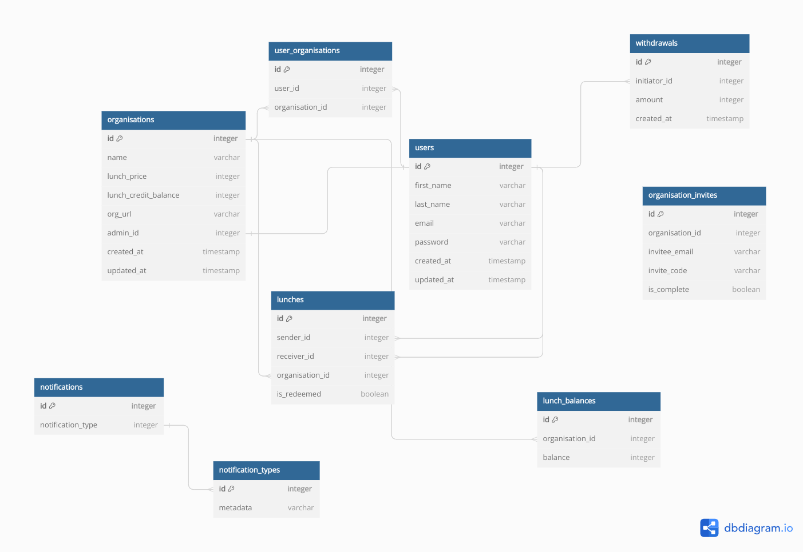
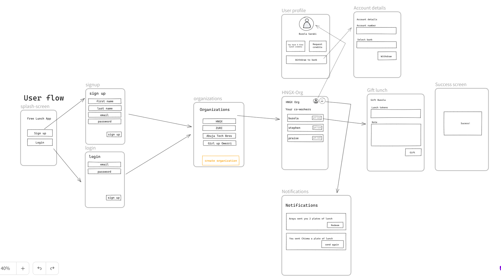

# Free Lunch App

This is a complete full-stack project for employees in an organisation to send lunches to each other. It is a structured like a multi-tenant application such that an employee will have one account but can belong to more than one organisation (think Slack).

## Repository Structure

The repository contains both the frontend and backend code. The frontend is a React.js frontend application packaged with Vite and the backend is an Express application. Both the frontend and backend are written in Typescript.

## Database Diagram

You can view the diagram and relationships of the models in the diagram below:

## Application Flow

The image below shows the user flow through the application in gifting lunch and seeing their lunch balance.

## Contributing

If you would like to suggest package updates or new necessary features, feel free to open a PR.

## LICENCE

MIT
